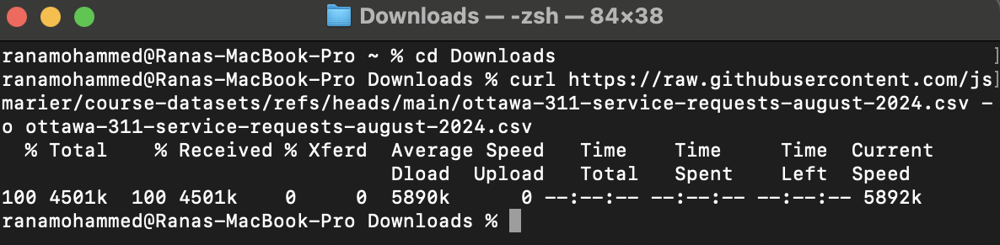
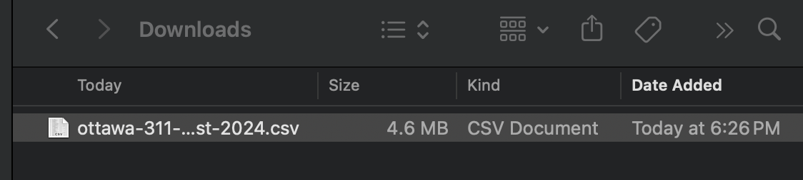
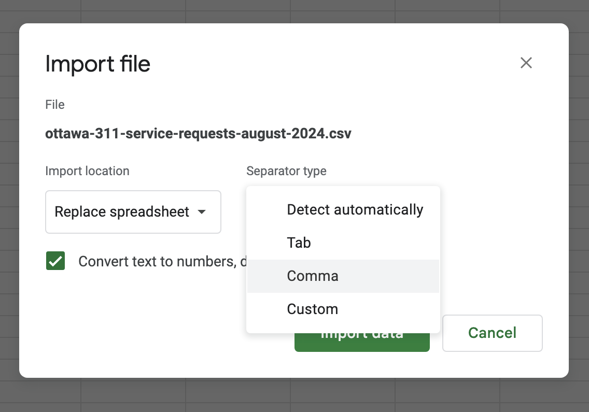
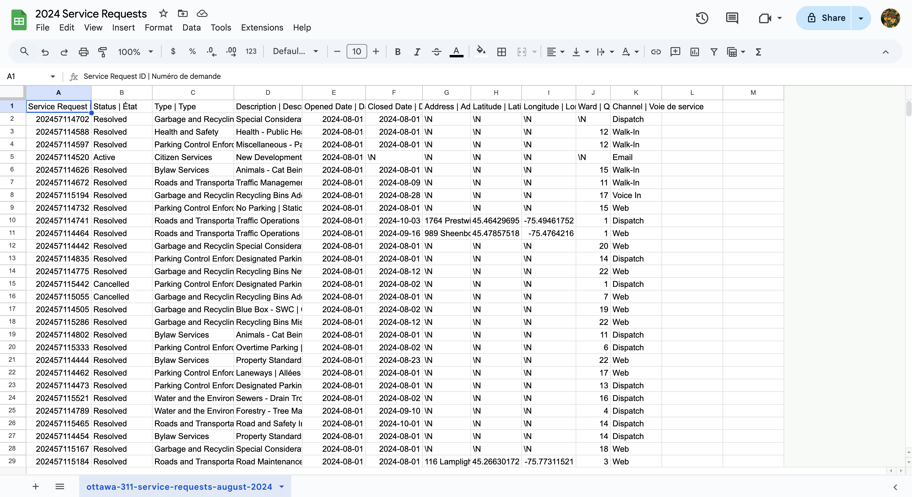
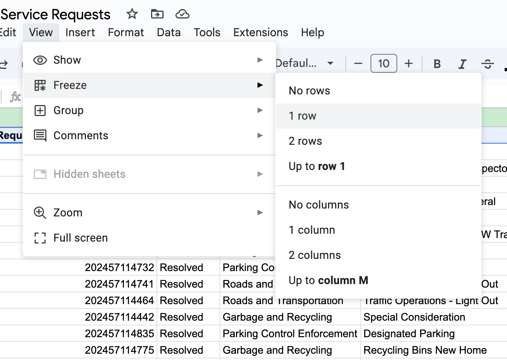
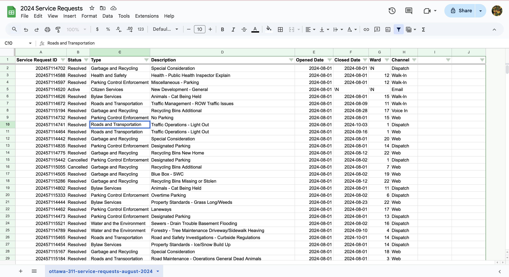
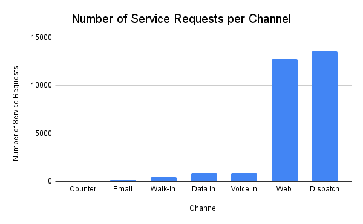

**November 4, 2024**  
**MPAD2003A** 
**Rana Mohammed** 
**Presented to Jean-Sébastien Marier** 

# Midterm Project: Exploratory Data Analysis (EDA)

* [The template repository for this assignment in case you delete something by mistake](https://github.com/jsmarier/jou4100_jou4500_mpad2003_project2_template)

## 1. Introduction

This assignment analyzes a subset of a City of Ottawa dataset called "2024 Service Requests" that provides a summary of requests for services that require action by City staff. The data extracted for this assignment is a smaller dataset of the original that contains only the data from August 2024.

The data was collected from 311 Contact Centre, Client Service Centre, 311 Email, and Web-based Self-Service portal. The data is organized by ward and shows the responsible city department and service request description.

**The data includes:**
- Service Request ID and number
- Status
- Description of request
- Type
- Opened and Closed Date
- Address, Latitude, and Longitude
- Ward Number that request relates to and Channel is was created in.

**Links to datasets:**
 [Open Ottawa original dataset](https://open.ottawa.ca/documents/65fe42e2502d442b8a774fd3d954cac5/about)
[CSV File of assignment dataset](https://raw.githubusercontent.com/jsmarier/course-datasets/refs/heads/main/ottawa-311-service-requests-august-2024.csv)

**This Assignment will discuss:**
1. Getting data
1. VIMO Analysis
1. Cleaning Data
1. Exploratory Data Analysis
1. Potential Story
1. Conclusion
1. References

## 2. Getting Data

**Importing Data into Google Sheets**

After clicking the CSV file it will open as text on the browser. To fix this, open up your terminal and type `cd` followed by a directory. This will move the CSV file to your chosen directory. I moved mine to downloads.

*Figure 1: The Terminal Command-lines for saving URL as CSV* 
Then type `curl` with the URL of the file after. Curl is a command-line tool that will transfer data with a URL. 

The CSV should be saved on your computer in the directory you chose. 

*Figure 2: The CSV file saved in the Downloads folder* 
Now to import the data into Google Sheets, open a blank sheet, go to the file at the top left, then click on import. A window will pop up. Go to upload and browse for the csv file or directly drag it into the box. Once you open the file, change the separator type to Comma and press import data.

*Figure 3: The Comma Separator Option in Google Sheets* 
This is what your dataset should look like.

*Figure 4: The Uncleaned Dataset in Google Sheets* 
[Public link to Google Sheet](https://docs.google.com/spreadsheets/d/1xgc5wnBqV-g7zAoFDNu-GEZtAgVmf5457g1r5QSJPEo/edit?usp=sharing) 
**General observations**

There are 11 columns and 28539 rows.
The data looks messy and crowded, especially the description because it includes both French and English in one column. There is a lot of missing data in the latitude, longitude, and address columns.
**Specific observations**

Column C features the type of service request using nominal variables. Column H shows the latitude with continuous variables, most of the data is missing. Column G displays the ward number belonging to the request in discrete variables. 

**Question/Hypothesis**

*Do some wards get more of a specific type of service request, such as Garbage and Recycling than other wards?*

I hypothesize that service requests such as Parking Control enforcement and Roads and Transportation are more common in dense wards like 14 (Somerset), which covers the downtown and centre-town area. 

*Figure 5: The Wards of Ottawa* 
*Are certain service requests more common to be cancelled or still active?*

Road and transportation requests are more likely to remain active because they take longer to fix.

## 3. Understanding Data

### 3.1. VIMO Analysis
I will assess the quality, accuracy, and reliability of the data by conducting a VIMO analysis, mainly focusing on the three columns mentioned in the previous section.

VIMO is an acronym for **V**alid, **I**nvalid, **M**issing and **O**utlier data values.

**Valid values**
For data to be accurate, the values are valid, meaning not blank and within a valid range.
The data in the dataset is valid because there are no impossible values and the data is within a valid range.

**Invalid values**
Invalid data are values that are impossible or make no sense in the dataset.
There are no invalid values in this dataset.

**Missing**
There are many missing values in this dataset including the descriptions in column d for most water and the environment type in column C.
Most of the values for Latitude, longitude, and address are missing as well.
However, the missing data is not left blank, it is marked as "\N" which is a valid way to show missing data.

**Outliers**
There isn't any noticable outliers in the dataset. 

**Is the data reliable?**
Since there are no invalid or outlier data we can canclude that the data is reliable, there are a few missing values but that does not effect the understanding of the dataset. 

Support your claims by citing relevant sources. Please follow [APA guidelines for in-text citations](https://apastyle.apa.org/style-grammar-guidelines/citations).

**For example:**

As Cairo (2016) argues, a data visualization should be truthful...

### 3.2. Cleaning Data

The first thing I did to clean my data was resize the column sizes to see all the values. I did this by selecting everything and double-clicking between 2 columns which automatically resizes all of them. 
I wanted to be able to individually look at the different types of requests, statuses, and channels. I applied filters by selecting the entire first row, right-clicking and pressing apply filters. Then to know what column I was looking at, I froze the first row by selecting it, going to view, freeze and selecting 1 row. This way the titles will show no matter how far down I scroll. 

*Figure 6: Freezing the First Row in Google Sheets* 

Column D is too crowded and messy because it includes both English and French descriptions. I deleted the French part by using the `SPLIT` function.
First I right-clicked on the column to make 1 column on the right then did that again till I had 2. On the second row of the blank, I typed `=SPLIT(D2; "|")`.
This function splits the text at | which divides the French and English descriptions. I applied this function to both entire columns by double-clicking on the bottom right circle of the box because dragging it down is too time-consuming.

To delete the original column without losing the new ones I selected both new columns, copied them then went to edit at the top left corner and pressed paste special, paste values only.

Since I deleted the French portion, I also went ahead and removed the French part of the titles manually for a cleaner look.

Lastly, I deleted the address, latitude, and longitude columns because I didn’t find it important to know where the request was made. Most of the values for them are missing because they are only displayed for public service requests. 
Here is the cleaned dataset:

*Figure 7: The Cleaned Dataset in Google Sheets* 

### 3.3. Exploratory Data Analysis (EDA)

For the Exploratory Data Analysis, I created a pivot table to see the number of requests for each type of channel. I did this by selecting the entire dataset, going to data at the top left and pressing create pivot table to new sheet.
For row I selected channel, for values I selected service request ID and set summerize by to COUNTA. This way I can see the number of requests for each channel.  
**Pivot Table**

*Figure 8: This pivot table shows the number of service requests for each Channel*

I created a chart to visualize the data. I selected the entire pivot table, went to insert at the top left and selected chart. I chose a bar chart because it is the best way to compare the number of requests for each channel.  
 
*Figure 9: This exploratory chart shows the number of service requests for each Channel*

## 4. Potential Story

The Data suggests that the most common service requests are made through dispatch and the web. Dispatch are communication workers who are responsible for receiving and transmitting information to coordinate operations. This makes sense as to why they are the most common. That aside, the potential story from this dataset is that people prefer quick and non-interactive ways to make service requests. Web requests are high in volume, whereas email, walk-in and phone requests are extremely low. This suggests that people prefer to make requests from the comfort of their own homes and limit human interaction. 
I would interview a City of Ottawa employee to see if they have noticed an increase in web requests due to the pandemic or if it has always been this way. According to a research paper by Hemanth (2020), People have reported that their face-to-face interactions have heavily decreased during the pandemic, with 36.4% of students reporting that they have not met a single person outside of their household. This could be a reason why people are making more web requests. Since they are not used to face-to-face interactions anymore, society adapted to remote forms of communication.

## 5. Conclusion

Insert text here.

## 6. References

Hemanth, L. K. (2020). Changing Trends of Social Interaction during the Pandemic and Its Effects on Mental Health – A Student’s Perspective. Asian Journal of Education and Social Studies, 9(3), 7–14. https://doi.org/10.9734/ajess/2020/v9i330247

Bounegru, L., & Gray, J. (Eds.). (2021). *The Data Journalism Handbook 2: Towards A Critical Data Practice*. Amsterdam University Press. [https://ocul-crl.primo.exlibrisgroup.com/permalink/01OCUL_CRL/hgdufh/alma991022890087305153](https://ocul-crl.primo.exlibrisgroup.com/permalink/01OCUL_CRL/hgdufh/alma991022890087305153)
